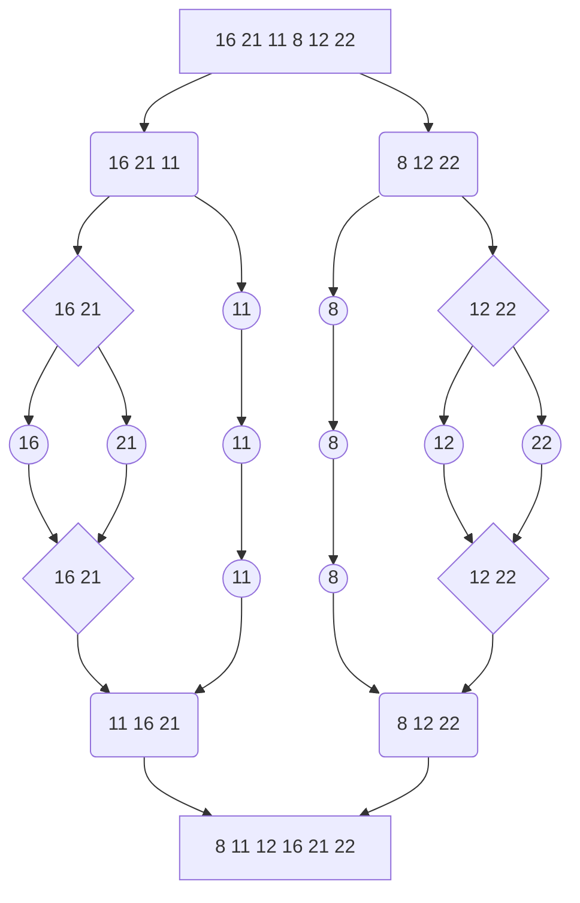

# Merge Sort Project

Click here[here](https://app.patika.dev/courses/veri-yapilari-ve-algoritmalar/merge-sort-proje) to see project page.

Merge Sort is one of the most popular [sorting algorithms](https://www.programiz.com/dsa/sorting-algorithm) that is based on the principle of [Divide and Conquer Algorithm](https://www.programiz.com/dsa/divide-and-conquer).

(Source: https://www.programiz.com/dsa/merge-sort)

Given array: **[16, 21, 11, 8, 12, 22]**
The algorithm we'll use: **merge sort**

Sorted array (ascending): **[8, 11, 12, 16, 21, 22]**

Big-O notation: **O(n * log n)**
